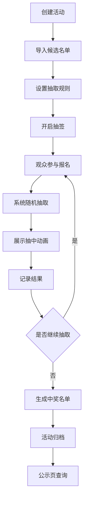

## 1. 产品概述
盲盒拆盒直播抽签系统，为直播主、助播和参与抽签的观众提供全流程抽签管理解决方案。系统解决了直播拆盒过程中的公平性、透明度和互动性问题，让每一轮抽签规则清晰可见，结果可追溯。

- **核心价值**：提升直播互动体验，确保抽签过程公开透明，降低主播操作复杂度
- **目标用户**：直播主（主持人）、助播（管理员）、直播间观众（参与者）

## 2. 核心特性

### 2.1 用户角色
| 角色 | 登录方式 | 核心权限 |
|------|----------|----------|
| 直播主（主持人） | 密码登录 | 完全控制：导入名单、设置规则、开始/暂停抽签、异常重抽、活动归档 |
| 助播（管理员） | 密码登录 | 辅助操作：弹幕审核、现场补抽、黑名单管理、数据导出 |
| 观众（参与者） | 无需登录 | 查看抽签进度、弹幕提交、口令报名、核对中奖结果 |

### 2.2 功能模块
1. **直播间控制台**：候选名单管理、轮次设置、抽取模式切换、规则展示
2. **实时抽签页**：编号池展示、抽中结果动画、补位情况、剩余名额统计、弹幕互动
3. **结果公示页**：中奖名单、拆盒顺序、回放记录、个人中奖查询
4. **系统管理**：黑名单、异常重抽、主持提示、分组抽取、活动归档

### 2.3 页面详情
| 页面名称 | 模块名称 | 功能描述 |
|---------|----------|----------|
| 登录页 | 身份验证 | 角色选择、密码登录、活动选择 |
| 控制台首页 | 活动管理 | 创建/编辑活动、活动列表、活动归档/恢复 |
| 直播间控制台 | 名单管理 | 导入候选名单（Excel/CSV）、手动添加/删除、分组管理 |
| 直播间控制台 | 规则设置 | 轮次配置、抽取人数、重复参与限制、连抽/单抽模式 |
| 直播间控制台 | 抽取控制 | 开始/暂停/重置、异常重抽、补位抽取、主持提示切换 |
| 实时抽签页 | 抽签展示 | 编号池滚动动画、抽中结果特效、已抽中列表、剩余名额 |
| 实时抽签页 | 观众互动 | 弹幕提交、口令报名、实时审核 |
| 结果公示页 | 中奖名单 | 按轮次展示、搜索筛选、导出功能 |
| 结果公示页 | 拆盒顺序 | 拆盒安排、状态更新、进度追踪 |
| 结果公示页 | 回放记录 | 每轮操作日志、时间戳、操作人员 |
| 结果公示页 | 中奖查询 | 观众输入编号查询是否中奖 |
| 系统设置 | 黑名单管理 | 添加/移除黑名单、批量操作 |
| 系统设置 | 分组管理 | 创建分组、分配成员、分组抽取设置 |

## 3. 核心流程

### 3.1 抽签主流程
1. 主播创建活动并导入候选名单
2. 设置抽取规则（轮次、人数、是否允许重复）
3. 开启抽签，观众通过口令报名或弹幕参与
4. 系统随机抽取，实时展示结果动画
5. 结果自动记录，生成中奖名单和拆盒顺序
6. 活动结束后归档，观众可在公示页查询结果

### 3.2 异常处理流程
1. 抽取过程中发现异常（如黑名单用户被抽中）
2. 主播触发异常重抽
3. 系统标记原结果无效，自动补位抽取
4. 记录异常操作日志，确保可追溯

## 4. 用户界面设计

### 4.1 设计风格
- **主色调**：深邃紫 (#6366f1) 作为主色，象征神秘和惊喜
- **辅助色**：霓虹粉 (#ec4899) 强调互动，金色 (#f59e0b) 突出中奖结果
- **背景**：深色渐变背景 (#0f0f23 → #1a1a2e)，营造直播氛围
- **按钮风格**：圆角胶囊按钮，悬停时有霓虹发光效果
- **字体**：展示字体使用 ZCOOL KuaiLe（站酷快乐体），正文字体使用 Noto Sans SC
- **图标**：使用 lucide-react 图标库，搭配霓虹发光效果

### 4.2 页面设计概览
| 页面名称 | 模块名称 | UI 元素 |
|---------|----------|---------|
| 登录页 | 身份验证 | 深色背景、霓虹发光登录框、角色切换标签、粒子动画背景 |
| 直播间控制台 | 操作面板 | 左侧导航栏、中间抽签控制区、右侧实时数据面板、底部弹幕区 |
| 实时抽签页 | 抽签展示 | 巨大的中央抽取动画区、顶部规则横幅、左侧编号池、右侧已抽中列表 |
| 结果公示页 | 中奖展示 | 卡片式中奖名单、时间线式拆盒顺序、搜索框、分页器 |

### 4.3 响应式设计
- **桌面优先**：核心交互区域（控制台、抽签页）针对 1920×1080 分辨率优化
- **平板适配**：调整面板布局，支持横竖屏切换
- **手机适配**：观众端公示页和查询功能优先适配移动设备，采用单列布局
- **触屏优化**：关键按钮尺寸 ≥ 48×48px，支持滑动切换轮次

### 4.4 动画效果
- **抽取动画**：数字滚动效果，最终定格时有放大闪光特效
- **中奖特效**：五彩纸屑粒子爆炸，金色光环扩散
- **页面切换**：淡入淡出 + 轻微缩放过渡
- **弹幕效果**：从右向左滑动，支持彩色弹幕
- **微交互**：按钮悬停霓虹发光，卡片悬停轻微上浮
