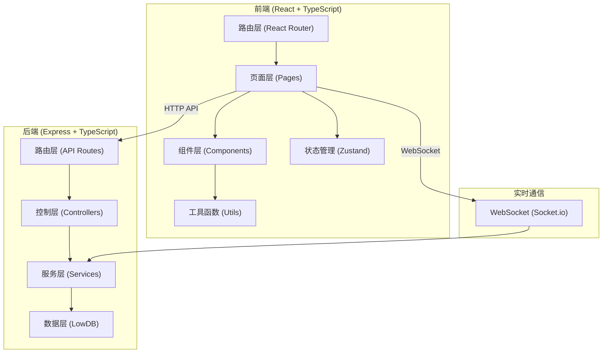
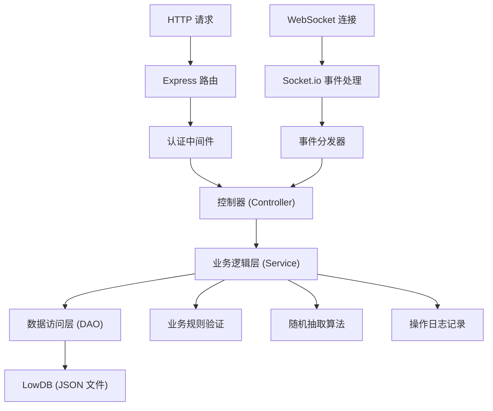
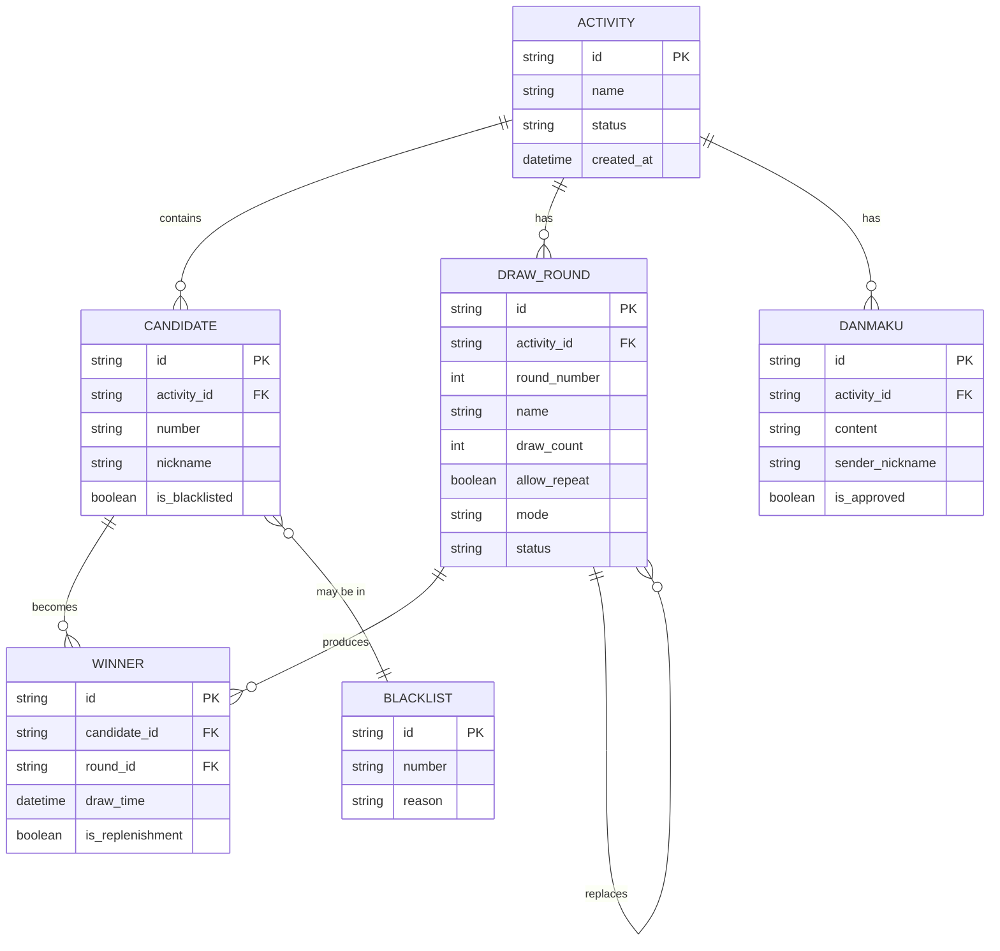

## 1. 架构设计



## 2. 技术说明

- **前端**：React@18 + TypeScript + Vite + TailwindCSS@3 + Zustand + Socket.io-client
- **后端**：Express@4 + TypeScript + Socket.io + LowDB（本地 JSON 文件存储）
- **初始化工具**：vite-init，使用 react-express-ts 模板
- **数据存储**：LowDB（基于 JSON 文件），无需额外数据库服务
- **实时通信**：Socket.io 实现抽签结果实时推送、弹幕实时同步

## 3. 路由定义

| 路由路径 | 页面名称 | 权限要求 |
|---------|---------|----------|
| `/login` | 登录页 | 公开 |
| `/console` | 直播间控制台 | 主播/助播 |
| `/draw` | 实时抽签页 | 公开（嵌入直播） |
| `/results` | 结果公示页 | 公开 |
| `/results/winners` | 中奖名单 | 公开 |
| `/results/unboxing` | 拆盒顺序 | 公开 |
| `/results/query` | 中奖查询 | 公开 |
| `/settings` | 系统设置 | 主播/助播 |
| `/archive` | 活动归档 | 主播/助播 |

## 4. API 定义

### 4.1 TypeScript 类型定义
```typescript
// 活动
interface Activity {
  id: string;
  name: string;
  description: string;
  status: 'draft' | 'active' | 'completed' | 'archived';
  createdAt: string;
  startedAt?: string;
  endedAt?: string;
}

// 候选者
interface Candidate {
  id: string;
  activityId: string;
  number: string;
  nickname?: string;
  groupId?: string;
  isBlacklisted: boolean;
  createdAt: string;
}

// 抽取轮次
interface DrawRound {
  id: string;
  activityId: string;
  roundNumber: number;
  name: string;
  drawCount: number;
  allowRepeat: boolean;
  mode: 'single' | 'multi';
  status: 'pending' | 'drawing' | 'completed';
  winners: Winner[];
  createdAt: string;
}

// 中奖者
interface Winner {
  id: string;
  candidateId: string;
  candidate: Candidate;
  roundId: string;
  drawTime: string;
  isReplenishment: boolean;
  replacedWinnerId?: string;
  operatorId?: string;
}

// 弹幕
interface Danmaku {
  id: string;
  activityId: string;
  content: string;
  senderNickname: string;
  isApproved: boolean;
  createdAt: string;
}

// 黑名单
interface Blacklist {
  id: string;
  number: string;
  reason: string;
  createdAt: string;
}
```

### 4.2 API 接口列表
| 方法 | 路径 | 说明 |
|------|------|------|
| POST | `/api/auth/login` | 登录验证 |
| GET | `/api/activities` | 获取活动列表 |
| POST | `/api/activities` | 创建活动 |
| PUT | `/api/activities/:id` | 更新活动信息 |
| POST | `/api/activities/:id/import` | 导入候选名单 |
| POST | `/api/activities/:id/start` | 开始活动 |
| POST | `/api/activities/:id/end` | 结束活动 |
| POST | `/api/activities/:id/archive` | 归档活动 |
| GET | `/api/activities/:id/candidates` | 获取候选名单 |
| POST | `/api/activities/:id/candidates` | 添加候选者 |
| DELETE | `/api/activities/:id/candidates/:cid` | 删除候选者 |
| GET | `/api/activities/:id/rounds` | 获取轮次列表 |
| POST | `/api/activities/:id/rounds` | 创建抽取轮次 |
| PUT | `/api/activities/:id/rounds/:rid` | 更新轮次设置 |
| POST | `/api/activities/:id/rounds/:rid/draw` | 执行抽取 |
| POST | `/api/activities/:id/rounds/:rid/redraw` | 异常重抽 |
| GET | `/api/activities/:id/winners` | 获取中奖名单 |
| GET | `/api/activities/:id/danmaku` | 获取弹幕列表 |
| POST | `/api/activities/:id/danmaku` | 发送弹幕 |
| POST | `/api/activities/:id/danmaku/:did/approve` | 审核通过弹幕 |
| GET | `/api/blacklist` | 获取黑名单 |
| POST | `/api/blacklist` | 添加黑名单 |
| DELETE | `/api/blacklist/:id` | 移除黑名单 |

## 5. 服务端架构图



## 6. 数据模型

### 6.1 ER 图


### 6.2 数据文件结构
项目使用 LowDB，数据存储在 `api/data/db.json` 文件中，结构如下：
```json
{
  "users": [],
  "activities": [],
  "candidates": [],
  "rounds": [],
  "winners": [],
  "danmaku": [],
  "blacklist": [],
  "operationLogs": []
}
```
